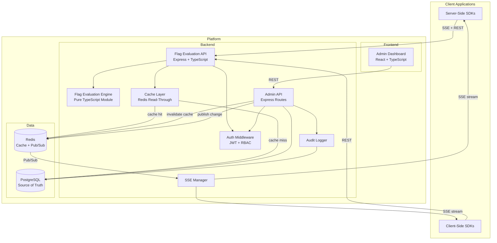
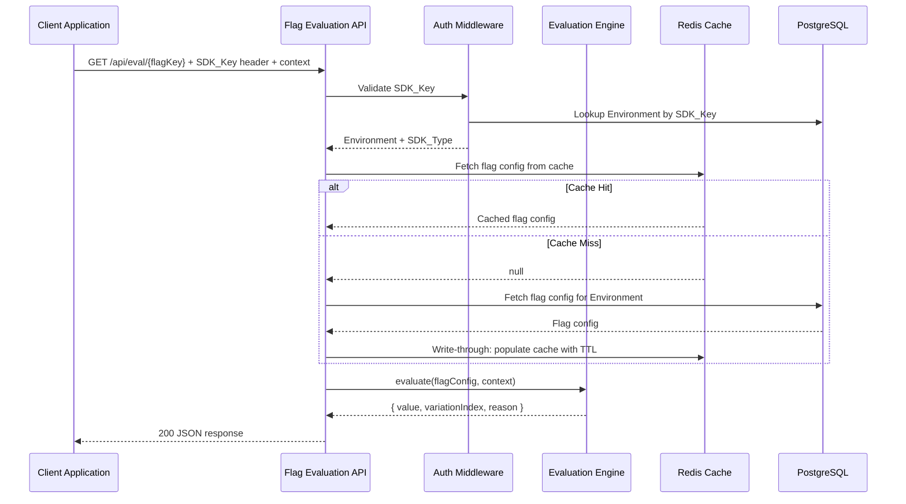
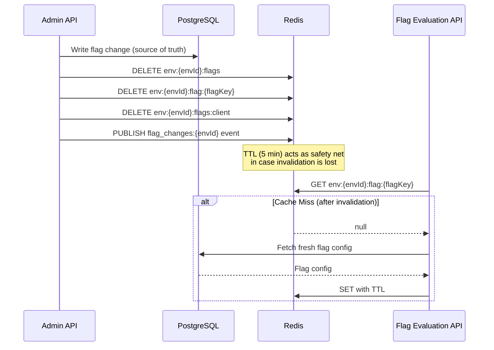
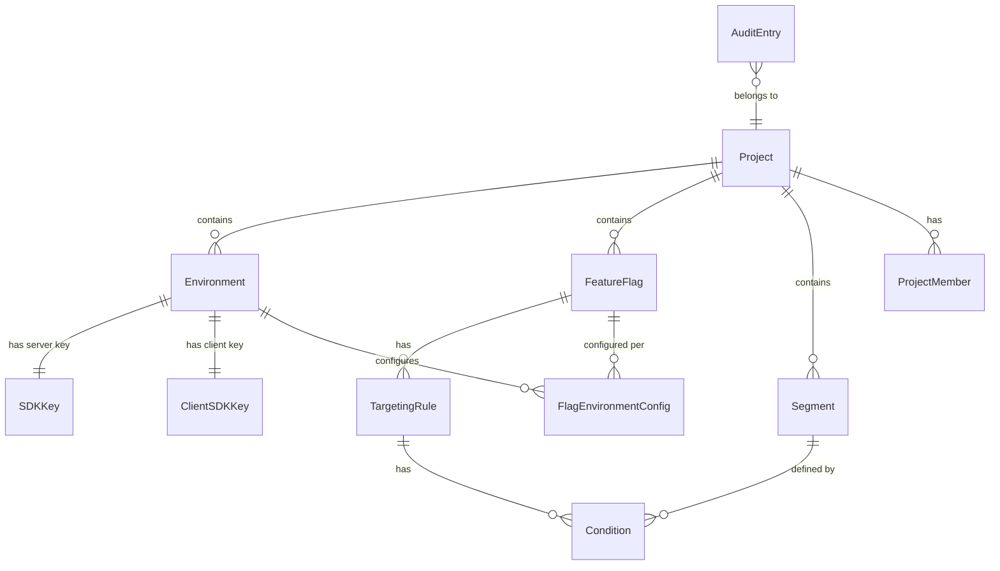

# Design Document: LaunchDarkly Config Panel

## Overview

This design describes a standalone feature flag management platform. The system consists of three primary subsystems:

1. **Admin Dashboard** — A web-based SPA (React + TypeScript) for Operators to manage flags, environments, projects, segments, and users.
2. **Flag Evaluation API** — An HTTP API (Node.js + Express + TypeScript) that Client_Applications call to evaluate flags and subscribe to real-time updates via SSE.
3. **Flag Evaluation Engine** — A pure, deterministic module that resolves a flag's variation given a flag configuration and an Evaluation_Context.

Data is persisted in PostgreSQL (source of truth). A Redis caching layer sits between the Flag Evaluation API and PostgreSQL, providing sub-millisecond reads for per-environment flag configurations at scale. Redis Pub/Sub replaces PostgreSQL LISTEN/NOTIFY for real-time change propagation across multiple API server instances. Authentication uses JWT tokens. The system is organized by Projects, each containing Environments, Feature Flags, and Segments.

### Key Design Decisions

| Decision | Rationale |
|---|---|
| TypeScript everywhere (frontend + backend) | Shared types for flag configs, evaluation contexts, and API contracts reduce bugs at integration boundaries. |
| PostgreSQL | JSONB columns for variations and targeting rules give schema flexibility. Remains the durable source of truth for all flag data. |
| Redis as read-through cache | Sub-millisecond flag reads at scale (millions of evaluations). Write-through invalidation on flag changes with TTL-based expiry as a safety net. Graceful degradation to direct PG queries if Redis is unavailable. |
| Redis Pub/Sub for change propagation | Replaces PostgreSQL LISTEN/NOTIFY. Scales horizontally across multiple API server instances without per-instance PG connections for LISTEN. |
| Evaluation Engine as a pure module | Determinism is critical (Req 2.4). A pure function with no I/O is easy to test with property-based testing and can be embedded in Server_Side_SDKs. |
| SSE for real-time updates | Simpler than WebSockets, works through proxies, and is sufficient for unidirectional flag change notifications (Req 9.2). |
| MurmurHash3 for percentage rollouts | Fast, well-distributed, deterministic hash suitable for consistent user bucketing (Req 2.5). |

## Architecture



### Request Flow: Flag Evaluation



## Components and Interfaces

### 1. Flag Evaluation Engine (`/src/engine/`)

The core deterministic evaluation module. Zero I/O, zero side effects.

```typescript
interface EvaluationResult {
  value: FlagValue;
  variationIndex: number;
  reason: EvaluationReason;
}

type EvaluationReason =
  | { kind: "OFF" }
  | { kind: "TARGET_MATCH"; ruleIndex: number }
  | { kind: "ROLLOUT"; ruleIndex: number }
  | { kind: "DEFAULT" }
  | { kind: "ERROR"; errorKind: string };

type FlagValue = boolean | string | number | object;

function evaluate(
  flag: FeatureFlagConfig,
  context: EvaluationContext,
  segments: Map<string, Segment>
): EvaluationResult;
```

Key sub-functions:
- `matchesRule(rule: TargetingRule, context: EvaluationContext, segments: Map<string, Segment>): boolean`
- `matchesCondition(condition: Condition, contextValue: unknown): boolean`
- `computeRolloutBucket(userKey: string, flagKey: string, salt: string): number` — returns 0–99999 (100k buckets for 0.001% granularity)
- `resolveVariation(flag: FeatureFlagConfig, variationIndex: number): FlagValue`

### 2. Admin API (`/src/api/admin/`)

REST endpoints for the Admin Dashboard.

| Endpoint | Method | Description |
|---|---|---|
| `/api/projects` | GET, POST | List/create projects |
| `/api/projects/:projectId` | GET, PUT, DELETE | Project CRUD |
| `/api/projects/:projectId/environments` | GET, POST | List/create environments |
| `/api/projects/:projectId/environments/:envId` | GET, PUT, DELETE | Environment CRUD |
| `/api/projects/:projectId/flags` | GET, POST | List/create flags |
| `/api/projects/:projectId/flags/:flagKey` | GET, PUT, DELETE | Flag CRUD |
| `/api/projects/:projectId/flags/:flagKey/targeting` | PUT | Update targeting rules |
| `/api/projects/:projectId/flags/:flagKey/toggle` | PATCH | Toggle flag on/off |
| `/api/projects/:projectId/segments` | GET, POST | List/create segments |
| `/api/projects/:projectId/segments/:segmentId` | GET, PUT, DELETE | Segment CRUD |
| `/api/projects/:projectId/flags/:flagKey/export` | GET | Export flag config as JSON |
| `/api/projects/:projectId/flags/import` | POST | Import flag config from JSON |
| `/api/projects/:projectId/audit-log` | GET | Query audit log |
| `/api/projects/:projectId/members` | GET, POST, PUT, DELETE | Manage project members/roles |

### 3. Flag Evaluation API (`/src/api/evaluation/`)

Endpoints for Client_Applications.

| Endpoint | Method | Description |
|---|---|---|
| `/api/eval/:flagKey` | POST | Evaluate single flag |
| `/api/eval` | POST | Bulk evaluate all flags |
| `/api/eval/stream` | GET | SSE stream for flag updates |
| `/api/sdk/config` | GET | Full flag config download (Server-Side SDKs) |

Authentication: `Authorization: Bearer <SDK_Key>` or `Authorization: Bearer <Client_Side_SDK_Key>` header.

### 4. SSE Manager (`/src/sse/`)

Manages SSE connections and broadcasts flag change events.

```typescript
interface FlagChangeEvent {
  flagKey: string;
  environmentId: string;
  timestamp: string;
  version: number;
}

class SSEManager {
  private redisSubscriber: RedisClient;

  addConnection(envId: string, sdkType: SDKType, res: Response): void;
  removeConnection(envId: string, connectionId: string): void;
  broadcast(envId: string, event: FlagChangeEvent): void;
  getLastEventId(envId: string): string; // For reconnection support

  /** Subscribe to Redis Pub/Sub channels for active environments */
  subscribeToEnvironment(envId: string): void;
  /** Unsubscribe when no connections remain for an environment */
  unsubscribeFromEnvironment(envId: string): void;
}
```

Redis Pub/Sub channel `flag_changes:{environmentId}` is used so that all API instances receive change notifications, regardless of which instance processed the admin request. This replaces the previous PostgreSQL LISTEN/NOTIFY approach and scales better across multiple API server instances since it avoids per-instance PG connections dedicated to LISTEN.

**Change propagation flow:**
1. Admin API writes flag change to PostgreSQL
2. Admin API publishes event to Redis channel `flag_changes:{environmentId}`
3. All SSE Manager instances subscribed to that channel receive the event
4. Each SSE Manager broadcasts to its locally connected SSE clients

### 5. Redis Cache Layer (`/src/cache/`)

A read-through cache between the Flag Evaluation API and PostgreSQL, providing sub-millisecond reads for flag configurations at scale.

```typescript
interface CacheConfig {
  redisUrl: string;
  defaultTTLSeconds: number;  // 300 (5 minutes) safety-net TTL
  connectTimeoutMs: number;
  maxRetriesPerRequest: number;
}

class FlagCacheService {
  constructor(redisClient: RedisClient, config: CacheConfig);

  /** Get full flag config for an environment (server-side SDK config endpoint) */
  getEnvironmentFlags(envId: string): Promise<FlagEnvironmentConfig[] | null>;

  /** Get individual flag config (single flag evaluation) */
  getFlag(envId: string, flagKey: string): Promise<FlagEnvironmentConfig | null>;

  /** Get client-side-available flags only (client-side SDK evaluation) */
  getClientFlags(envId: string): Promise<FlagEnvironmentConfig[] | null>;

  /** Write-through: update cache after a flag change is persisted to PG */
  invalidateAndRefresh(envId: string, flagKey: string): Promise<void>;

  /** Invalidate all cache keys for an environment (e.g., environment deletion) */
  invalidateEnvironment(envId: string): Promise<void>;

  /** Cache warming: pre-populate cache from PG for active environments on startup */
  warmCache(activeEnvironmentIds: string[]): Promise<void>;

  /** Health check: returns true if Redis is reachable */
  isHealthy(): Promise<boolean>;
}
```

**Cache key patterns:**

| Key Pattern | Value | Used By |
|---|---|---|
| `env:{environmentId}:flags` | Full flag config array (JSON) | Server-side SDK config endpoint |
| `env:{environmentId}:flag:{flagKey}` | Individual flag config (JSON) | Single flag evaluation |
| `env:{environmentId}:flags:client` | Client-side-available flags only (JSON) | Client-side SDK evaluation |

**Cache invalidation strategy:**



**Write-through invalidation**: When the Admin API persists a flag change to PostgreSQL, it immediately deletes the affected Redis keys and publishes a change event. The next read from any API instance triggers a cache miss, fetching fresh data from PG and repopulating the cache.

**TTL-based expiry**: All cache entries have a 5-minute TTL as a safety net. If an invalidation message is lost (e.g., network partition between Admin API and Redis), stale data self-expires within 5 minutes.

**Cache warming**: On API server startup, the cache service pre-populates Redis from PostgreSQL for all active environments. This avoids a thundering herd of cache misses when a new instance joins the cluster.

**Graceful degradation**: If Redis is unavailable (connection failure, timeout), the Flag Evaluation API falls back to direct PostgreSQL queries. Latency degrades but the system remains functional. The cache service logs warnings and periodically retries Redis connectivity.

```typescript
async function getFlagConfig(envId: string, flagKey: string): Promise<FlagEnvironmentConfig> {
  if (cacheService.isHealthy()) {
    const cached = await cacheService.getFlag(envId, flagKey);
    if (cached) return cached;
  }
  // Fallback: direct PG query
  const config = await db.getFlagEnvironmentConfig(envId, flagKey);
  // Attempt to populate cache (best-effort, non-blocking)
  cacheService.getFlag(envId, flagKey).catch(() => {});
  return config;
}
```

### 6. Audit Logger (`/src/audit/`)

```typescript
interface AuditEntry {
  id: string;
  projectId: string;
  entityType: "flag" | "segment" | "environment" | "project";
  entityKey: string;
  action: "create" | "update" | "delete" | "toggle" | "targeting_change";
  operatorId: string;
  timestamp: Date;
  previousValue: object | null;
  newValue: object | null;
}

function recordAuditEntry(entry: Omit<AuditEntry, "id" | "timestamp">): Promise<AuditEntry>;
function queryAuditLog(filters: AuditLogFilters): Promise<PaginatedResult<AuditEntry>>;
```

### 7. Auth Middleware (`/src/auth/`)

Two authentication paths:
- **Operator auth**: JWT token in cookie/header → validates identity, extracts role for RBAC.
- **SDK auth**: SDK_Key or Client_Side_SDK_Key in Authorization header → resolves to Environment + SDK_Type.

```typescript
type Role = "admin" | "editor" | "viewer";

interface OperatorSession {
  operatorId: string;
  projectId: string;
  role: Role;
}

interface SDKSession {
  environmentId: string;
  projectId: string;
  sdkType: "server" | "client";
}
```

RBAC permission matrix:

| Action | Admin | Editor | Viewer |
|---|---|---|---|
| Create/delete flags | ✓ | ✓ | ✗ |
| Update flag config | ✓ | ✓ | ✗ |
| Toggle flags | ✓ | ✓ | ✗ |
| View flags | ✓ | ✓ | ✓ |
| Manage environments | ✓ | ✗ | ✗ |
| Manage project members | ✓ | ✗ | ✗ |
| View audit log | ✓ | ✓ | ✓ |
| Export/import flags | ✓ | ✓ | ✗ |

### 8. Admin Dashboard (`/src/frontend/`)

React SPA with the following views:
- **Project Switcher** — top-level navigation
- **Flag List** — searchable/filterable table with environment toggle switches
- **Flag Detail** — variations editor, targeting rules editor (drag-to-reorder), per-environment config
- **Segments** — segment list and condition builder
- **Environments** — environment list with SDK key display/copy
- **Audit Log** — filterable log viewer
- **Settings** — project members and role management


## Data Models

### Core Entities



### Entity Definitions

```typescript
// === Project ===
interface Project {
  id: string;           // UUID
  name: string;
  key: string;          // unique slug
  createdAt: Date;
  updatedAt: Date;
}

// === Environment ===
interface Environment {
  id: string;           // UUID
  projectId: string;
  name: string;
  key: string;          // unique within project
  sdkKey: string;       // server-side SDK key (secret)
  clientSdkKey: string; // client-side SDK key (restricted scope)
  createdAt: Date;
}

// === Feature Flag ===
interface FeatureFlag {
  id: string;
  projectId: string;
  key: string;          // unique within project
  name: string;
  description: string;
  flagType: "boolean" | "string" | "number" | "json";
  variations: Variation[];
  tags: string[];
  clientSideAvailable: boolean;
  createdAt: Date;
  updatedAt: Date;
}

interface Variation {
  id: string;
  value: FlagValue;
  name: string;
  description?: string;
}

// === Per-Environment Flag Config ===
interface FlagEnvironmentConfig {
  flagId: string;
  environmentId: string;
  enabled: boolean;           // on/off toggle
  defaultVariationIndex: number;
  offVariationIndex: number;
  targetingRules: TargetingRule[];
  version: number;            // incremented on each change
}

// === Targeting Rules ===
interface TargetingRule {
  id: string;
  priority: number;           // lower = evaluated first
  description?: string;
  clauses: Clause[];          // AND logic within a rule
  rollout: Rollout;
}

interface Clause {
  attribute: string;          // e.g., "key", "email", "country", "sdkType"
  operator: ClauseOperator;
  values: unknown[];          // values to match against
  negate: boolean;
}

type ClauseOperator =
  | "eq" | "neq"
  | "contains" | "startsWith" | "endsWith"
  | "gt" | "lt" | "gte" | "lte"
  | "in" | "segmentMatch";

// === Rollout ===
type Rollout =
  | { kind: "single"; variationIndex: number }
  | { kind: "percentage"; buckets: RolloutBucket[] };

interface RolloutBucket {
  variationIndex: number;
  weight: number;             // 0–100000 (for 0.001% precision)
}

// === Segment ===
interface Segment {
  id: string;
  projectId: string;
  key: string;
  name: string;
  description?: string;
  rules: SegmentRule[];       // OR logic between rules
  createdAt: Date;
  updatedAt: Date;
}

interface SegmentRule {
  clauses: Clause[];          // AND logic within a rule
}

// === Evaluation Context ===
interface EvaluationContext {
  key: string;                // required user key
  [attribute: string]: unknown;
}

// === Audit Log ===
interface AuditEntry {
  id: string;
  projectId: string;
  entityType: "flag" | "segment" | "environment" | "project";
  entityKey: string;
  action: "create" | "update" | "delete" | "toggle" | "targeting_change";
  operatorId: string;
  operatorEmail: string;
  timestamp: Date;
  previousValue: object | null;
  newValue: object | null;
}

// === Project Member ===
interface ProjectMember {
  id: string;
  projectId: string;
  operatorId: string;
  role: "admin" | "editor" | "viewer";
  invitedAt: Date;
}
```

### Database Schema (PostgreSQL)

Key tables: `projects`, `environments`, `feature_flags`, `variations`, `flag_environment_configs` (stores targeting rules as JSONB), `segments`, `segment_rules` (JSONB), `audit_log`, `operators`, `project_members`.

The `flag_environment_configs` table stores `targeting_rules` as a JSONB column to allow flexible rule structures while keeping the environment-flag relationship relational. A `version` column supports optimistic concurrency and SSE event ordering.

Index strategy:
- `feature_flags(project_id, key)` — unique, for flag lookup
- `environments(project_id, key)` — unique
- `environments(sdk_key)` — unique, for SDK auth
- `environments(client_sdk_key)` — unique, for client SDK auth
- `audit_log(project_id, timestamp DESC)` — for log queries
- `audit_log(entity_key, project_id)` — for per-flag audit log
- `flag_environment_configs(flag_id, environment_id)` — unique composite


## Correctness Properties

*A property is a characteristic or behavior that should hold true across all valid executions of a system — essentially, a formal statement about what the system should do. Properties serve as the bridge between human-readable specifications and machine-verifiable correctness guarantees.*

### Property 1: Flag CRUD Round-Trip

*For any* valid flag creation request (with a unique key, name, flag type, and variations), creating the flag and then reading it back by key should return a flag entity with the same key, name, type, and variations as the original request, and listing all flags for the project should include the created flag.

**Validates: Requirements 1.1, 1.2, 1.3**

### Property 2: Duplicate Flag Key Rejection

*For any* project and any existing flag key within that project, attempting to create a second flag with the same key should be rejected with an error, and the total number of flags in the project should remain unchanged.

**Validates: Requirements 1.6**

### Property 3: Flag Update Persistence

*For any* existing flag and any valid update to its configuration (name, description, variations, tags, clientSideAvailable), applying the update and then reading the flag should reflect the new values.

**Validates: Requirements 1.4**

### Property 4: Flag Deletion Removes From All Environments

*For any* existing flag in a project with multiple environments, deleting the flag should make it unfindable by key and remove its configuration from every environment in the project.

**Validates: Requirements 1.5**

### Property 5: Priority-Ordered Rule Evaluation

*For any* flag configuration with multiple targeting rules where more than one rule matches a given Evaluation_Context, the evaluation engine should return the variation from the rule with the lowest priority number (highest priority).

**Validates: Requirements 2.1, 3.5**

### Property 6: Default Variation When No Rule Matches

*For any* enabled flag configuration and any Evaluation_Context that does not match any targeting rule, the evaluation engine should return the default variation configured for that environment, with reason kind "DEFAULT".

**Validates: Requirements 2.2**

### Property 7: Off Variation When Flag Disabled

*For any* flag configuration where `enabled` is false and any Evaluation_Context (including contexts that would match targeting rules if the flag were enabled), the evaluation engine should return the off variation with reason kind "OFF".

**Validates: Requirements 2.3**

### Property 8: Deterministic Evaluation

*For any* flag configuration and any Evaluation_Context, calling `evaluate` multiple times with the same inputs should always produce the same `EvaluationResult` (same value, variationIndex, and reason).

**Validates: Requirements 2.4**

### Property 9: Deterministic Percentage Rollout Hashing

*For any* user key, flag key, and salt, calling `computeRolloutBucket` multiple times should always return the same bucket value, and the bucket value should be in the range [0, 99999].

**Validates: Requirements 2.5**

### Property 10: Individual User Key Targeting

*For any* flag with a targeting rule that targets a set of individual user keys, evaluating with a context whose `key` is in that set should return the rule's specified variation, and evaluating with a context whose `key` is not in that set should not match that rule.

**Validates: Requirements 3.1**

### Property 11: Segment-Based Targeting

*For any* segment defined by attribute-based conditions and any Evaluation_Context, the evaluation engine should serve the segment rule's variation if and only if the context's attributes satisfy all of the segment's conditions.

**Validates: Requirements 3.2**

### Property 12: Percentage Rollout Distribution

*For any* percentage rollout configuration with specified bucket weights, distributing a large set of randomly generated user keys should produce a variation distribution that approximates the configured percentages within a statistical tolerance (e.g., ±5% for 1000+ users).

**Validates: Requirements 3.3**

### Property 13: Environment Independence

*For any* flag that exists in two or more environments, updating the flag's configuration (toggle state, targeting rules, default variation) in one environment should leave the flag's configuration in all other environments unchanged.

**Validates: Requirements 4.2**

### Property 14: New Flag Initialization Across Environments

*For any* newly created flag in a project with N environments, the flag should be initialized in all N environments with `enabled` set to false and `defaultVariationIndex` set to 0.

**Validates: Requirements 4.3**

### Property 15: Environment Deletion Cascades

*For any* deleted environment, the associated SDK key and client SDK key should no longer authenticate successfully, and no flag environment configurations should reference the deleted environment.

**Validates: Requirements 4.4**

### Property 16: Flag Search and Filter

*For any* set of flags in a project and any search query string, the search results should contain only flags whose name, key, or tags contain the query string (case-insensitive), and every flag matching the query should be included in the results.

**Validates: Requirements 5.4**

### Property 17: Authentication Required for Protected Endpoints

*For any* protected Admin API endpoint, a request without a valid authentication token should be rejected with a 401 status code.

**Validates: Requirements 6.1**

### Property 18: RBAC Enforcement

*For any* operator with a given role (admin, editor, viewer) and any action, the system should allow the action if and only if the role has permission for that action according to the RBAC permission matrix. Specifically: viewers cannot create, update, or delete flags; editors cannot manage environments or project members; admins can perform all actions.

**Validates: Requirements 6.2, 6.4**

### Property 19: Audit Log Completeness for Flag Changes

*For any* flag mutation operation (create, update, delete, toggle, targeting rule change), after the operation completes, the audit log should contain an entry with the correct operator identity, a timestamp not before the operation start time, the correct change type, and accurate previous and new values.

**Validates: Requirements 7.1**

### Property 20: Audit Log Completeness for Segment Changes

*For any* segment mutation operation (create, update, delete), after the operation completes, the audit log should contain an entry with the correct operator identity, timestamp, change type, and accurate previous and new values.

**Validates: Requirements 7.2**

### Property 21: Audit Log Ordering and Filtering

*For any* set of audit log entries in a project, querying the audit log should return entries in reverse chronological order, and applying filters (by flag key, operator, or date range) should return only entries matching all specified filter criteria.

**Validates: Requirements 7.3**

### Property 22: Audit Log Immutability

*For any* existing audit log entry, there should be no operation available that modifies or deletes the entry. Attempting to update or delete an audit entry should fail.

**Validates: Requirements 7.4**

### Property 23: Evaluation Response Completeness

*For any* valid evaluation request (single or bulk), the response should include for each evaluated flag: the variation value, the variation index, and a reason object. For bulk evaluation, the number of results should equal the number of flags in the environment (or client-side-available flags for client SDK keys).

**Validates: Requirements 8.2, 8.5**

### Property 24: SDK Authentication Validation

*For any* request to the Flag Evaluation API with an invalid, missing, or revoked SDK key, the API should respond with a 401 Unauthorized status.

**Validates: Requirements 8.4**

### Property 25: SSE Event Content

*For any* flag configuration change in an environment, the resulting SSE event should contain the flag key and a timestamp, and the timestamp should not be before the time the change was made.

**Validates: Requirements 9.3**

### Property 26: Project Isolation

*For any* two distinct projects, using an SDK key from project A to evaluate flags should never return flags belonging to project B, and querying flags/segments/environments in project A should never include entities from project B.

**Validates: Requirements 10.3**

### Property 27: Project Deletion Cascades

*For any* deleted project, all associated feature flags, environments, segments, SDK keys, and client SDK keys should be removed and no longer accessible.

**Validates: Requirements 10.4**

### Property 28: Flag Configuration Serialization Round-Trip

*For any* valid Feature_Flag configuration (including variations, targeting rules, and segment references), serializing to JSON and then parsing back should produce an equivalent Feature_Flag configuration.

**Validates: Requirements 11.3**

### Property 29: Invalid JSON Import Rejection

*For any* malformed or schema-invalid JSON document, attempting to import it as a flag configuration should be rejected with a validation error, and no flag should be created or modified.

**Validates: Requirements 11.4**

### Property 30: Server-Side SDK Receives Full Configuration

*For any* environment with N flags, the SDK config endpoint authenticated with a server-side SDK key should return configurations for all N flags, each including variations, targeting rules, and environment-specific settings.

**Validates: Requirements 12.2**

### Property 31: Client-Side SDK Receives Only Resolved Values

*For any* client-side evaluation request, the response should contain only resolved variation values (not full flag configurations with targeting rules), and should not expose server-side-only flags.

**Validates: Requirements 12.3**

### Property 32: Environment Key Generation

*For any* newly created environment, the system should generate both an SDK key and a client-side SDK key, both should be unique across all environments, and they should be distinct from each other.

**Validates: Requirements 4.1, 12.4**

### Property 33: Client-Side SDK Key Filters to Client-Side-Available Flags

*For any* environment containing a mix of client-side-available and non-client-side-available flags, authenticating with a client-side SDK key should return only the flags marked as client-side-available.

**Validates: Requirements 12.5**

### Property 34: SDK Connection Type Identification

*For any* valid SDK key (server-side or client-side), the platform should correctly identify the SDK type and return environment configuration appropriate for that type — full config for server-side, evaluated values for client-side.

**Validates: Requirements 12.7**

### Property 35: SDK_Type Attribute Targeting

*For any* targeting rule with a clause matching on the `sdkType` attribute and any Evaluation_Context containing an `sdkType` value, the evaluation engine should match the rule if and only if the context's `sdkType` satisfies the clause condition.

**Validates: Requirements 12.10, 12.11**

### Property 36: Cache Consistency After Flag Update

*For any* flag configuration change persisted to PostgreSQL, after cache invalidation completes, reading the flag through the Redis cache layer should return a configuration equivalent to what is stored in PostgreSQL.

**Validates: Requirements 9.1** (change propagation within 5 seconds implies cache must be consistent)

### Property 37: Cache Invalidation Completeness

*For any* flag update in a given environment, the cache invalidation step should delete all three affected Redis keys (`env:{envId}:flags`, `env:{envId}:flag:{flagKey}`, `env:{envId}:flags:client`), so that no stale data remains for that environment's flag set.

**Validates: Requirements 9.1, 8.3**

### Property 38: Graceful Degradation Without Redis

*For any* flag evaluation request, if Redis is unavailable, the Flag Evaluation API should fall back to direct PostgreSQL queries and return the same correct evaluation result as it would with a warm cache.

**Validates: Requirements 8.1, 8.3**

### Property 39: Cache Warming Consistency

*For any* set of active environments, after cache warming completes on API server startup, the cached flag configurations in Redis should be equivalent to the flag configurations stored in PostgreSQL for those environments.

**Validates: Requirements 12.2, 8.3**


## Error Handling

### API Error Response Format

All API errors use a consistent JSON envelope:

```json
{
  "error": {
    "code": "INVALID_FLAG_KEY",
    "message": "A flag with key 'my-flag' already exists in this project.",
    "status": 409
  }
}
```

### Error Categories

| Category | HTTP Status | Examples |
|---|---|---|
| Authentication | 401 | Missing/invalid JWT, expired token, invalid SDK key |
| Authorization | 403 | Viewer attempting flag creation, editor managing environments |
| Not Found | 404 | Non-existent flag key, project, environment, segment |
| Conflict | 409 | Duplicate flag key, duplicate environment key |
| Validation | 422 | Invalid flag type, malformed targeting rule, invalid JSON import, percentage rollout weights not summing to 100000 |
| Last Resource | 422 | Attempting to delete the last environment in a project |
| Server Error | 500 | Database connection failure, unexpected errors |

### Evaluation Engine Errors

The evaluation engine never throws. Instead, it returns an `EvaluationResult` with reason kind `"ERROR"`:

```typescript
// Flag not found
{ value: null, variationIndex: -1, reason: { kind: "ERROR", errorKind: "FLAG_NOT_FOUND" } }

// Invalid context (missing key)
{ value: null, variationIndex: -1, reason: { kind: "ERROR", errorKind: "INVALID_CONTEXT" } }

// Malformed flag config (e.g., variationIndex out of bounds)
{ value: null, variationIndex: -1, reason: { kind: "ERROR", errorKind: "MALFORMED_FLAG" } }
```

### SSE Connection Error Handling

- On connection drop, clients reconnect using the `Last-Event-ID` header.
- The server maintains a bounded event buffer (last 1000 events per environment) in Redis for catch-up, enabling any API instance to serve reconnection requests.
- If the requested `Last-Event-ID` is no longer in the buffer, the server sends a full state refresh event.

### Redis Failure Handling

- If Redis is unreachable on startup, cache warming is skipped and the API starts in degraded mode (direct PG queries).
- If Redis becomes unreachable at runtime, the cache service circuit-breaker opens after 3 consecutive failures, routing all reads directly to PostgreSQL.
- The circuit-breaker half-opens every 30 seconds to test Redis connectivity and automatically restores caching when Redis recovers.
- Redis Pub/Sub disconnection: SSE Manager falls back to polling PostgreSQL for changes at a 1-second interval until the Redis subscription is restored.

### Import/Export Error Handling

- JSON schema validation runs before any database writes.
- Validation errors include the JSON path of the offending field (e.g., `$.variations[2].value`).
- Partial imports are not supported — the entire import succeeds or fails atomically.

## Testing Strategy

### Dual Testing Approach

The platform uses both unit tests and property-based tests for comprehensive coverage:

- **Unit tests** (Jest): Specific examples, edge cases, integration points, error conditions
- **Property-based tests** (fast-check): Universal properties across randomly generated inputs

### Property-Based Testing Configuration

- **Library**: [fast-check](https://github.com/dubzzz/fast-check) for TypeScript
- **Minimum iterations**: 100 per property test
- **Each property test must reference its design document property** using the tag format:
  `// Feature: launchdarkly-config-panel, Property {number}: {property_text}`
- **Each correctness property is implemented by a single property-based test**

### Test Organization

```
tests/
├── unit/
│   ├── engine/           # Evaluation engine unit tests
│   ├── api/              # API endpoint unit tests
│   ├── auth/             # Auth middleware unit tests
│   ├── audit/            # Audit logger unit tests
│   ├── cache/            # Redis cache layer unit tests
│   └── serialization/    # Import/export unit tests
├── property/
│   ├── engine/           # Properties 5–12, 35 (evaluation engine)
│   ├── crud/             # Properties 1–4 (flag CRUD)
│   ├── auth/             # Properties 17, 18, 24 (auth & RBAC)
│   ├── audit/            # Properties 19–22 (audit logging)
│   ├── environment/      # Properties 13–15, 32 (environment management)
│   ├── search/           # Property 16 (flag search)
│   ├── evaluation-api/   # Properties 23, 25, 30, 31, 33, 34 (API responses)
│   ├── project/          # Properties 26, 27 (project isolation & deletion)
│   ├── serialization/    # Properties 28, 29 (round-trip & validation)
│   └── cache/            # Properties 36–39 (cache consistency & degradation)
└── integration/
    ├── sse/              # SSE streaming integration tests (Redis Pub/Sub)
    ├── cache/            # Redis cache integration tests (warming, TTL, failover)
    └── e2e/              # End-to-end API workflow tests
```

### Unit Test Focus Areas

- Edge cases: empty targeting rules, zero-weight rollout buckets, flags with single variation
- Error conditions: invalid SDK keys (Req 2.7), non-existent flags (Req 2.6), last environment deletion (Req 4.5)
- Specific examples: boolean flag creation (Req 1.7), project creation with default "production" environment (Req 10.1), unauthenticated redirect (Req 6.3)
- Integration: SSE endpoint existence (Req 9.2), SSE reconnection (Req 9.4, 12.8), SDK config download (Req 12.2)
- Cache: Redis connection failure handling, TTL expiry behavior, cache key format correctness, Pub/Sub channel subscription/unsubscription lifecycle

### Property Test Generators (fast-check Arbitraries)

Key generators needed for property tests:

- `arbFlagType()` — generates `"boolean" | "string" | "number" | "json"`
- `arbVariations(flagType)` — generates valid variation arrays for a given flag type
- `arbEvaluationContext()` — generates contexts with random keys and attributes
- `arbTargetingRule(variations)` — generates valid targeting rules with clauses and rollouts
- `arbFlagConfig()` — generates complete flag configurations
- `arbSegment()` — generates segments with random attribute conditions
- `arbClause()` — generates clauses with various operators and values
- `arbPercentageRollout(variationCount)` — generates rollout buckets that sum to 100000
- `arbCacheState(envId)` — generates cache states (warm, cold, partial) for cache consistency tests

### Testing Priority

1. **Evaluation Engine** (Properties 5–12, 35) — highest priority, core correctness
2. **Serialization Round-Trip** (Property 28) — data integrity
3. **Cache Consistency** (Properties 36–39) — data freshness at scale
4. **Auth & RBAC** (Properties 17, 18, 24) — security
5. **CRUD & Data Integrity** (Properties 1–4, 13–15, 26–27, 32) — data correctness
6. **API Response Shape** (Properties 23, 30, 31, 33, 34) — contract correctness
7. **Audit & Search** (Properties 16, 19–22, 25) — operational correctness
